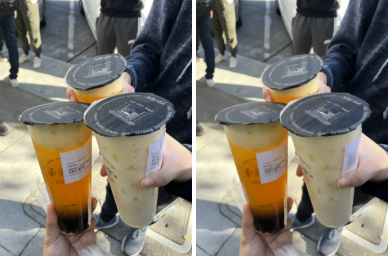
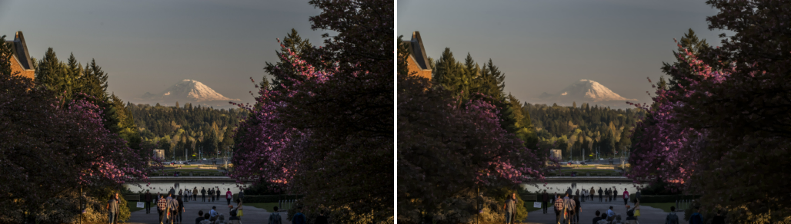

# Primitive — Go + Enhanced Hill Climbing Image Reconstruction

Forked from [fogleman/primitive](https://github.com/fogleman/primitive), with a set of
scoring/placement enhancements ported over from a Python prototype and rewritten
natively in Go.

## Examples

**Boba** — original vs. reconstruction (10k shapes, combo mode):



**Mt. Rainier** — original vs. reconstruction (~100k shapes, combo mode):



## Dependencies

- `github.com/fogleman/gg` — 2D graphics context
- `github.com/golang/freetype` — anti-aliased rasterization
- `golang.org/x/image` — image math utilities
- `github.com/nfnt/resize` — image resizing
- **ImageMagick (`convert` on `$PATH`)** — required only for `.gif` output. PNG/JPG/SVG
  output has no external dependency. Install with `brew install imagemagick` (macOS) or
  `apt install imagemagick` (Debian/Ubuntu).

## How to run

```bash
# Build (first time, or after code changes)
go build -o primitive-enhanced .

# Run with triangles (default)
./primitive-enhanced -i photo.jpg -o output/result.png -n 500

# Combo mode — randomly mixes all 8 shape types (triangle, rect, ellipse,
# circle, rotated rect, bezier, rotated ellipse, polygon), picking a
# different one each step. Usually the best starting point if you're not
# sure which single shape suits your image.
./primitive-enhanced -i photo.jpg -o output/result.png -n 500 -m 0

# Run with ellipses
./primitive-enhanced -i photo.jpg -o output/result.png -n 500 -m 3

# Disable Lab scoring (faster, less perceptual accuracy)
./primitive-enhanced -i photo.jpg -o output/result.png -n 500 -no-lab

# Animated GIF showing shapes being added over time (requires ImageMagick)
./primitive-enhanced -i photo.jpg -o output/result.gif -n 200

# All shape modes: 0=combo 1=triangle 2=rect 3=ellipse 4=circle
#   5=rotatedrect 6=beziers 7=rotatedellipse 8=polygon

# Outputs:
#   output/result.png              — final reconstruction
#   output/result_comparison.png   — side-by-side (original | reconstruction)
```

## Project structure

```
Primitive/
├── main.go                    — CLI entry point, progress display
├── go.mod / go.sum            — Go module dependencies
├── primitive-enhanced         — compiled binary
├── primitive/
│   ├── model.go               — orchestrator: annealing, error/edge maps, winner refinement
│   ├── worker.go              — parallel workers: biased placement, Lab scoring
│   ├── core.go                — color compute, solveColorAlpha, difference functions
│   ├── lab.go                 — CIE Lab conversion with linearization LUT
│   ├── edge.go                — Sobel edge map, error map, weighted sampling
│   ├── optimize.go            — hill climbing + simulated annealing
│   ├── state.go                — state wrapper for optimization (do/undo moves)
│   ├── shape.go               — Shape interface definition
│   ├── triangle.go            — triangle shape
│   ├── rectangle.go           — rectangle + rotated rectangle
│   ├── ellipse.go             — ellipse + circle + rotated ellipse
│   ├── polygon.go             — N-gon polygon
│   ├── quadratic.go           — quadratic Bézier curves
│   ├── scanline.go            — scanline representation
│   ├── raster.go              — freetype rasterization helpers
│   ├── color.go               — Color struct + hex parsing
│   ├── util.go                — image I/O, math helpers
│   ├── heatmap.go             — heat visualization (debug)
│   └── log.go                 — verbosity-controlled logging
├── _python_backup/            — original Python implementation (reference)
├── README.md                  — this file
└── output/                    — all generated images
```

## CLI flags

| Flag | Default | Effect |
|---|---|---|
| `-i` | (required) | Input image path |
| `-o` | (required) | Output image path (.png, .jpg, .svg, .gif) |
| `-n` | (required) | Number of shapes |
| `-m` | 1 | Shape mode: **0=combo (mixes all shape types, recommended default)**, 1=triangle, 2=rect, 3=ellipse, 4=circle, 5=rotatedrect, 6=beziers, 7=rotatedellipse, 8=polygon |
| `-a` | 128 | Alpha value (0–255) |
| `-r` | 256 | Resize input to this max dimension |
| `-s` | 1024 | Output image size |
| `-j` | all cores | Number of parallel workers |
| `-no-lab` | false | Disable CIE Lab scoring, use RGB |
| `-bg` | avg color | Background color (hex, e.g. `#ffffff`) |
| `-v` / `-vv` | false | Verbose / very verbose logging |
| `-rep` | 0 | Extra shapes per step with reduced search |
| `-nth` | 1 | Save every Nth frame (use `%d` in output path) |

## Enhancements over fogleman/primitive

1. **CIE Lab perceptual scoring** — uses Lab ΔE² instead of RGB RMSE. Precomputed
   linearization LUT + cached "before" Lab buffer for speed.
2. **Analytical color+alpha solve** (`solveColorAlpha`) — optimally solves for both
   RGB color AND alpha per shape, not just color at fixed alpha.
3. **3-phase size annealing** — shape max size follows 60%→25%→10%→3% schedule
   (phase boundaries at 40% and 75% completion). Large shapes first, details last.
4. **Edge-aware placement** — Sobel edge map biases 15% of shapes toward edges.
5. **Error-weighted placement** — error map biases 60% of shapes toward highest-error regions.
6. **Winner refinement** — 30 extra hill climb mutations on the best candidate per step.
7. **Incremental error map** — only recomputes bounding box of accepted shape.
8. **Auto comparison output** — saves side-by-side (original | reconstruction) PNG.

## How the algorithm works

1. Start with canvas filled with target's average color
2. Precompute: target Lab buffer, Sobel edge map, error map
3. For each step:
   - Compute max shape size from 3-phase annealing schedule
   - Sample focus points from error map (60%) and edge map (15%)
   - Distribute search across all CPU cores (goroutines, shared memory)
   - Each worker: 1000 random shapes → 16 best → 100-age hill climb each
   - Winner refinement: 30 extra mutations on the global best
   - Analytically solve optimal color + alpha for winner
   - Score with CIE Lab perceptual difference
   - Accept shape, update canvas and error map incrementally
4. Save output + comparison image

## Key design decisions

- **Lab scoring in workers** uses cached `CurrentLab` buffer (precomputed once per step)
  so only "after" pixels need Lab conversion — halves the conversion cost.
- **Linearization LUT** eliminates `math.Pow` calls in Lab conversion (256-entry table).
- **Goroutines with shared memory** — zero serialization overhead (unlike Python multiprocessing).
- **3-phase annealing** produces better results than fixed-size shapes because large shapes
  fill broad color regions first, then progressively smaller shapes add detail.

## Known limitations

- `.gif` output shells out to ImageMagick's `convert`; if it's not on `$PATH` the run
  fails with a clear error after computing all shapes (no partial/corrupt output).
